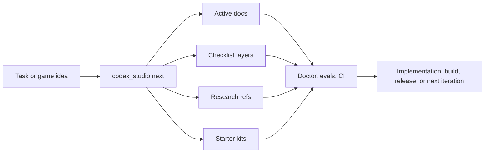

# Codex Game Studio Pro Max

> Plan. Route. Research. Validate. Ship.

A Codex-first multi-engine studio operating system for turning fuzzy game ideas into durable, engine-aware, testable work. The current Godot slice is a reference proof, not the main product. The main product is the system that helps a human operator and Codex keep working from repo truth instead of fragile chat memory across Godot, Unity, and Unreal.

`codex-first` `multi-engine` `game-development` `godot` `unity` `ue5` `starter-kits` `checklists` `research` `ci-cd` `developer-tooling`

Supported engine families: `Godot 4`, `Unity 6`, `Unreal 5`
Current reference implementation: `Godot 4`

## Why this repo exists

Game projects usually decay in the same ways:

- key decisions live in chat instead of the repo
- engine setup is half-documented and half-tribal knowledge
- feature briefs, risks, and validation paths drift apart
- CI only checks files, not the actual working contract
- research gets done once, then disappears

This repo exists to stop that drift.

It gives you:

- one source of truth in `studio.toml`
- one front-door CLI in `python3 scripts/codex_studio.py`
- one routing system for tasks, agents, docs, research, and checklists
- one starter-kit contract for `godot-4`, `unity-6`, and `unreal-5`
- one validation surface for docs, kits, evals, workflows, Docker, and active project state

## Multi-engine support, explicitly

This repo is not Godot-only.

- Godot 4: root reference slice in `src/`, smoke/export helpers, active project baseline
- Unity 6: starter kit with runtime scripts, editor build entrypoint, ScriptableObject surface, prefab/script folders, and edit-mode tests
- Unreal 5: starter kit with gameplay framework classes, health component, data asset surface, config defaults, Blueprint/content guidance, and packaging adapter flow

The shared system layer treats all three as first-class engine families for routing, checklists, research, and CI contract smoke.

## What this repo is

- a studio operating system for Codex-centered game development
- a planning and execution layer that survives across sessions
- a multi-engine starter-kit and validation platform
- a checklist and research system for gameplay, tools, pipeline, and production work

## What this repo is not

- not a finished commercial game
- not a full replacement for real engine editors
- not a fake "supports every engine" README with no adapter contract behind it
- not a one-off prompt pack that only works if someone remembers the thread history

## At a glance

- `studio.toml` holds project identity, engine selection, platforms, genre, checklist config, research policy, and tool paths
- `scripts/codex_studio.py` is the wizard-first entry point
- `studio/starter-kits/` contains engine adapters and scaffolds
- `studio/checklists/` contains mergeable checklist layers
- `studio/docs/active/` contains the living project state
- `docs/research/game-development/` contains durable research notes
- `.codex/agents/` and `.agents/skills/` define Codex behavior
- `.github/workflows/` and `Makefile` define CI/CD and local equivalents

## Typical flow



## Fastest start

Wizard mode:

```bash
python3 scripts/codex_studio.py init
```

Direct setup examples:

```bash
# Godot action prototype
python3 scripts/codex_studio.py init \
  --project-name "Signal Forge" \
  --engine godot-4 \
  --platform pc-premium \
  --genre action-roguelite \
  --yes

# Unity tactics prototype
python3 scripts/codex_studio.py init \
  --project-name "Grid Breakers" \
  --engine unity-6 \
  --platform pc-premium \
  --genre tactical-rpg \
  --yes

# Unreal co-op survival baseline
python3 scripts/codex_studio.py init \
  --project-name "Drift Colony" \
  --engine unreal-5 \
  --platform console-premium \
  --genre co-op-survival \
  --yes
```

## Real command examples

### Route the next task

```bash
python3 scripts/codex_studio.py next \
  "Implement a performant 2D enemy pathfinding pass for Unity" \
  --json
```

Example output excerpt:

```json
{
  "route": "combat / gameplay",
  "skills": ["combat-loop", "mechanic-design", "gameplay-slice"],
  "agents": ["combat_designer", "gameplay_programmer", "qa_tester"],
  "engine_kit": {
    "id": "unity-6",
    "engine": "unity",
    "version_family": "6000.x"
  },
  "research_refs": [
    "docs/research/game-development/engines/unity-6-class-editor-object-map.md",
    "docs/research/game-development/engines/unity-6-2d-3d-class-and-mechanic-guide.md",
    "docs/research/game-development/engines/unity-6-2d-3d-navigation-damage-performance.md",
    "docs/research/game-development/systems/ai-navigation-and-entity-scale-architecture.md"
  ]
}
```

### Render a merged checklist

```bash
python3 scripts/codex_studio.py checklist \
  --task "Ship the first Godot combat room" \
  --json
```

Example output excerpt:

```json
{
  "engine": "godot-4",
  "disciplines": ["gameplay"],
  "items": [
    {
      "id": "godot-static-smoke",
      "title": "Static smoke covers scene nodes, scripts, and export presets",
      "validation": "Run python3 scripts/godot_smoke.py --static-only"
    },
    {
      "id": "gameplay-readability",
      "title": "Core action remains readable before adding depth",
      "validation": "Document the teach/read/react loop in the active feature doc"
    }
  ]
}
```

### Scaffold a research note

```bash
python3 scripts/codex_studio.py research \
  --category systems \
  --title "Combat readability baseline"
```

That creates a dated note from the shared research template and keeps the result inside the repo instead of burying it in chat history.

### Inspect engine support

```bash
python3 scripts/codex_studio.py engine --list --json
```

Example output excerpt:

```json
[
  {
    "id": "godot-4",
    "engine": "godot",
    "version_family": "4.x"
  },
  {
    "id": "unity-6",
    "engine": "unity",
    "version_family": "6000.x"
  },
  {
    "id": "unreal-5",
    "engine": "unreal",
    "version_family": "5.x"
  }
]
```

## Common workflows

### 1. Solo Godot prototype

```bash
python3 scripts/codex_studio.py init --engine godot-4 --genre action-roguelite --yes
python3 scripts/codex_studio.py next "Design the first combat room"
python3 scripts/codex_studio.py checklist --task "Implement the first combat room"
python3 scripts/godot_smoke.py --static-only
python3 -m pytest -q tests/test_godot_surface.py
```

### 2. Unity architecture and performance pass

```bash
python3 scripts/codex_studio.py next "Refactor combat into a pooled projectile system for Unity"
python3 scripts/codex_studio.py checklist --task "Refactor combat into a pooled projectile system for Unity"
python3 scripts/unity_adapter.py test \
  --project-path studio/starter-kits/unity-6/scaffold \
  --unity-path tools/engine-stubs/unity/Unity \
  --dry-run --json
```

### 3. Unreal packaging prep

```bash
python3 scripts/codex_studio.py next "Prepare the first Unreal package flow for Win64"
python3 scripts/unreal_adapter.py package \
  --project-path studio/starter-kits/unreal-5/scaffold \
  --uat-path tools/engine-stubs/unreal/RunUAT.sh \
  --platform Win64 \
  --dry-run --json
python3 scripts/validate_engine_kits.py --engine unreal-5
```

### 4. Repo-wide health pass

```bash
python3 scripts/codex_studio.py doctor
python3 scripts/run_local_evals.py --json
python3 scripts/validate_workflows.py --json
make ci-local
```

## Engine support model

Each engine family now has a four-layer research pack:

- architecture baseline
- class/editor/object ownership map
- 2D/3D class and mechanic guide
- navigation, damage, and performance guide

Examples:

- `docs/research/game-development/engines/godot-4-2d-3d-class-and-mechanic-guide.md`
- `docs/research/game-development/engines/unity-6-2d-3d-class-and-mechanic-guide.md`
- `docs/research/game-development/engines/unreal-5-2d-3d-class-and-mechanic-guide.md`

Those guides are where the repo spells out the most-used classes, object ownership, mechanic patterns, writing style expectations, and common mistakes for each engine family.

This repo uses starter-kit parity, not fake gameplay parity.

| Engine | Kit ID | What is included | Local smoke path | Real editor requirement |
| --- | --- | --- | --- | --- |
| Godot | `godot-4` | scene/script/export baseline and reference combat slice | `python3 scripts/godot_smoke.py --static-only` | `GODOT_BIN` for runtime smoke/export |
| Unity | `unity-6` | package, asmdef, runtime sample, adapter, test/build command contract | `python3 scripts/unity_adapter.py ... --dry-run --json` | `UNITY_CLI` for editor-backed test/build |
| Unreal | `unreal-5` | project/module scaffold, gameplay sample surface, adapter, packaging contract | `python3 scripts/unreal_adapter.py ... --dry-run --json` | `UNREAL_UAT` or `UNREAL_EDITOR` for engine-backed packaging |

Inspect or validate all kits:

```bash
python3 scripts/codex_studio.py engine --list
python3 scripts/validate_engine_kits.py --json
python3 scripts/starter_kit_contract_smoke.py --engine godot-4 --json
python3 scripts/starter_kit_contract_smoke.py --engine unity-6 --json
python3 scripts/starter_kit_contract_smoke.py --engine unreal-5 --json
```

## Checklist system

Checklist resolution is layered and deterministic:

1. `base`
2. `engine`
3. `discipline`
4. `milestone`
5. `custom`

Custom rules live in `studio/checklists/custom/`.

This means a single task can automatically pull:

- repo-health checks
- engine-specific architecture checks
- gameplay or tools discipline checks
- milestone rules like `prototype` or `build-release`
- your own custom studio rules

## Research system

Research is part of the workflow, not a side quest.

Core research zones:

- `docs/research/game-development/engines/`
- `docs/research/game-development/systems/`
- `docs/research/game-development/production/`
- `docs/research/game-development/genre/`

Good places to start:

- `docs/research/game-development/engines/godot-4-class-editor-object-map.md`
- `docs/research/game-development/engines/unity-6-class-editor-object-map.md`
- `docs/research/game-development/engines/unreal-5-class-editor-object-map.md`
- `docs/research/game-development/systems/combat-damage-and-effects-architecture.md`
- `docs/research/game-development/systems/ai-navigation-and-entity-scale-architecture.md`
- `docs/research/game-development/genre/genre-example-matrix.md`

## CI/CD and release surface

This repo ships with a broad CI/CD layer and local equivalents.

| Workflow or command | Role | Output |
| --- | --- | --- |
| `make ci-local` | local CI-equivalent stack | `build/ci/local/` |
| `make ci-workflows` | validate workflow definitions themselves | JSON workflow report |
| `make starter-kit-smoke` | contract smoke across engines | per-engine smoke output |
| `make ci-report` | generate CI artifact summaries | `build/ci/local/ci-report.json` and `.md` |
| `.github/workflows/repo-validate.yml` | PR validation matrix | workflow artifacts |
| `.github/workflows/starter-kit-contracts.yml` | starter-kit contract smoke | engine artifact bundles |
| `.github/workflows/release-readiness.yml` | manual release-readiness bundle | build metadata artifact |
| `.github/workflows/nightly-audit.yml` | scheduled repo audit | audit artifact |

Example local CI stack:

```bash
make ci-workflows
python3 scripts/run_local_evals.py --json
python3 -m pytest -q tests
python3 scripts/ci_artifact_report.py --output-dir build/ci/manual-check --label manual-check --json
make docker-verify
```

See `docs/reference/ci-cd-architecture.md` for the full workflow map.

## Docker helper environment

If you want an isolated Ubuntu 24.04 + Python tooling shell:

```bash
docker compose build
docker compose run --rm app
```

Inside the container, the repository is mounted at `/app`.

## Repository map

```text
studio.toml
scripts/codex_studio.py
studio/starter-kits/
studio/checklists/
studio/docs/active/
docs/research/game-development/
.codex/agents/
.agents/skills/
.github/workflows/
tools/engine-stubs/
tests/
```

## Suggested GitHub metadata

Suggested repository description:

> A Codex-first multi-engine studio operating system for planning, routing, research, starter kits, and CI/CD.

Suggested topics:

- `codex`
- `multi-engine`
- `game-development`
- `game-studio`
- `developer-tooling`
- `starter-kits`
- `checklists`
- `ci-cd`
- `godot`
- `godot-engine`
- `unity`
- `unity3d`
- `ue5`
- `unreal-engine`
- `game-architecture`
- `research-driven-development`

Apply these later from the GitHub UI or with `gh repo edit`. See `docs/setup/github-maintainer-setup.md`.

## First 15 minutes

1. Run `python3 scripts/codex_studio.py init`
2. Open `studio.toml`
3. Open `studio/docs/active/game-brief.md`
4. Open `studio/docs/active/engine-profile.md`
5. Open `studio/docs/active/current-sprint.md`
6. Run `python3 scripts/codex_studio.py next "Describe the next gameplay or pipeline task"`
7. Run `python3 scripts/codex_studio.py checklist --task "Describe the same task"`
8. Run `python3 scripts/run_local_evals.py`
9. Run `python3 scripts/codex_studio.py doctor`

## FAQ

### Is the Godot sample the main product?

No. The Godot slice is a reference proof. The main product is the studio operating system around it.

### Does Unity and Unreal support require a local installation?

For real builds, yes. Contract smoke works with repo-local stubs, but editor-backed coverage starts when `UNITY_CLI`, `UNREAL_UAT`, or `UNREAL_EDITOR` points to a real installation.

### Can I use only one engine?

Yes. Set your primary engine in `studio.toml` and ignore the other kits until you need them.

### Can I add custom rules for my own team?

Yes. Put them in `studio/checklists/custom/` and route/checklist resolution will merge them after base, engine, discipline, and milestone layers.

### Is Docker required?

No. Docker is optional and only meant as a helper environment for scripts, docs, and validation tools.

### Can I keep my own language in project docs?

Yes, but the repo defaults to English-first onboarding and CLI output so the system stays easier to share, automate, and review.

## Further reading

- `docs/setup/first-hour-walkthrough.md`
- `docs/reference/engine-selection-guide.md`
- `docs/reference/workflow-recipes.md`
- `docs/reference/task-prompt-examples.md`
- `docs/reference/command-cheatsheet.md`
- `docs/reference/ci-cd-architecture.md`
- `docs/reference/engine-agent-guidelines.md`
- `docs/setup/getting-started.md`
- `docs/setup/github-maintainer-setup.md`
- `codex-game-studio-v3-roadmap.md`
- `CHANGELOG.md`
