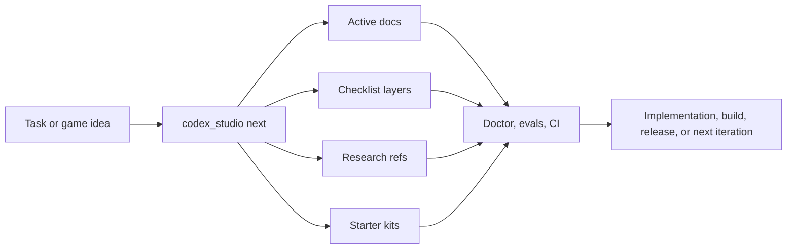

# Kaynexis Agentic Game Studio

> Plan. Route. Research. Validate. Ship.

A Codex-first multi-engine studio operating system for turning fuzzy game ideas into durable, engine-aware, testable work. The current Godot slice is a reference proof, not the main product. The main product is the system that helps a human operator and Codex keep working from repo truth instead of fragile chat memory across Godot, Unity, and Unreal.

`codex-first` `multi-engine` `game-development` `godot` `unity` `ue5` `starter-kits` `checklists` `research` `ci-cd` `developer-tooling`

Supported engine families: `Godot 4`, `Unity 6`, `Unreal 5`
Root runtime reference today: `Godot 4`

Fastest front door: `make start` or `python3 scripts/start_game_studio.py`.

## Studio map

If you only read one overview page, use `docs/reference/studio-map.md`. It is the compact, professional front door for the repo and it points to the right lane without repeating the whole tree.

## Core packs

| Pack | Purpose | Start here |
| --- | --- | --- |
| operating model | controller, role matrix, hierarchy, validation, review trails | `docs/reference/agent-system.md`, `docs/reference/mastermind-guide.md`, `docs/reference/agent-portfolio.md`, `docs/reference/agent-hierarchy.md` |
| work packets | execution packets, prompt history, transcripts, proof paths | `docs/reference/agent-execution.md`, `docs/reference/prompt-journal.md`, `docs/reference/agent-transcript.md`, `docs/reference/agent-validation-matrix.md` |
| engine and systems | engine choice, object ownership, engine atlas, system atlas | `docs/reference/engine-map.md`, `docs/reference/engine-atlas.md`, `docs/reference/system-atlas.md`, `docs/reference/engine-fit.md`, `docs/reference/engine-eval.md` |
| gameplay and genre | genre presets, genre plans, examples, theory, architecture | `docs/reference/genre-presets.md`, `docs/reference/genre-plan.md`, `docs/research/game-development/genre/genre-guide.md`, `docs/research/game-development/genre/genre-maturity.md`, `docs/reference/theory-guide.md`, `docs/reference/architecture-guide.md` |
| production and release | versioning, CI/CD, platform fit, Steam, sector, marketing, hardening | `docs/reference/ci-cd.md`, `docs/reference/version-guide.md`, `docs/reference/platform-guide.md`, `docs/reference/release-hardening-guide.md`, `docs/reference/steam-intel.md`, `docs/reference/sector-intel.md`, `docs/reference/marketing-guide.md`, `docs/reference/marketing-intel.md` |
| scale and customization | custom packs, custom architecture, extensions, libraries, assets, benchmarks, quality, perf, GPU | `docs/reference/custom-packs.md`, `docs/reference/custom-architecture.md`, `docs/reference/extensions-guide.md`, `docs/reference/library-guide.md`, `docs/reference/asset-guide.md`, `docs/reference/benchmark-guide.md`, `docs/reference/quality-guide.md`, `docs/reference/perf-guide.md`, `docs/reference/gpu-guide.md` |

## Engine families

| Engine | What it means here | Start here |
| --- | --- | --- |
| Godot 4 | reference slice and smoke/export helpers | `docs/research/game-development/engines/README.md`, `docs/reference/godot-atlas.md` |
| Unity 6 | starter-kit-first support with editor/runtime separation | `docs/research/game-development/engines/README.md`, `docs/reference/unity-atlas.md` |
| Unreal 5 | starter-kit-first support with gameplay framework and packaging | `docs/research/game-development/engines/README.md`, `docs/reference/unreal-atlas.md` |

## What this repo is

- a studio operating system for Codex-centered game development
- a planning and execution layer that survives across sessions
- a multi-engine starter-kit and validation platform
- a checklist and research system for gameplay, tools, pipeline, and production work
- a genre-aware support layer that can steer the major game families without collapsing everything into one default combat recipe

## What this repo is not

- not a finished commercial game
- not a full replacement for real engine editors
- not a fake "supports every engine" README with no adapter contract behind it
- not a one-off prompt pack that only works if someone remembers the thread history
- not a Godot-only template pretending to be multi-engine

## Genre and support families

The repo includes dedicated notes for `auto-battler`, `grand-strategy`, `stealth`, `city-builder`, `life-sim`, `hero-shooter`, `soulslike`, `co-op-survival`, `cozy-sim`, `extraction-lite`, `narrative-adventure`, `platformer`, `puzzle`, `tactical-rpg`, `sandbox-survival`, `tower-defense`, `4X`, `rhythm-action`, `management-sim`, and `immersive-sim`.

## Execution glue

- handoff contracts, traceability, prompt journals, transcripts, and execution packets keep planning and shipping tied together
- the examples index groups those packs so the same naming and routing contract stays visible
- doc-sync, validation, and eval plans keep the repo truthful when the structure shifts

## What this repo is

- a studio operating system for Codex-centered game development
- a planning and execution layer that survives across sessions
- a multi-engine starter-kit and validation platform
- a checklist and research system for gameplay, tools, pipeline, and production work
- a genre-aware support layer that can steer action, strategy, simulation, stealth, life-sim, hero-shooter, auto-battler, and soulslike projects without collapsing everything into one default combat recipe

## What this repo is not

- not a finished commercial game
- not a full replacement for real engine editors
- not a fake "supports every engine" README with no adapter contract behind it
- not a one-off prompt pack that only works if someone remembers the thread history
- not a Godot-only template pretending to be multi-engine

## New support families

These genre families now have dedicated preset, contrast-set, and architecture notes:

- `auto-battler` for drafting economy, small-board placement, and round resolution
- `grand-strategy` for realm planning, diplomacy, and campaign-scale persistence
- `stealth` for patrol readability, suspicion states, and objective routing
- `city-builder` for zoning, transport bottlenecks, and simulation legibility
- `life-sim` for routine, identity, relationships, and long-horizon attachment
- `hero-shooter` for role kits, objective play, and teamfight readability
- `soulslike` for telegraph reading, stamina commitment, and recovery mastery

Each family points at a different first-risk profile, so the repo can stop offering the same opening advice for every idea.

## At a glance

- `studio.toml` holds project identity, engine selection, platforms, genre, checklist config, research policy, and tool paths
- `scripts/codex_studio.py` is the wizard-first entry point
- `studio/starter-kits/` contains engine adapters and scaffolds
- `studio/checklists/` contains mergeable checklist layers
- `studio/docs/active/` contains the living project state
- `docs/research/game-development/` contains durable research notes
- `.codex/agents/` and `.agents/skills/` define Codex behavior
- `.github/workflows/` and `Makefile` define CI/CD and local equivalents

## Which command should I run?

Use this table when you do not want to think about the internal architecture first.

If you want the shortest setup path, run `make start` or `python3 scripts/start_game_studio.py`, then open `docs/setup/quick-access.md` for the fastest access bundle.

| If you want to... | Run this | Why |
| --- | --- | --- |
| set up or reset the project baseline | `make start` | shortest front door for the guided setup flow |
| decide what to work on next | `python3 scripts/codex_studio.py next "your task"` | routes the task to the right skills, agents, docs, and research |
| see what must be true before calling the task done | `python3 scripts/codex_studio.py checklist --task "your task"` | merges base, engine, discipline, milestone, and custom checklist layers |
| create a durable research note before architecture work | `python3 scripts/codex_studio.py research --category systems --title "your note"` | keeps reasoning in the repo instead of chat history |
| inspect engine support or kit contracts | `python3 scripts/codex_studio.py engine --list --json` | shows which engine families the system recognizes |
| compare Codex models or ChatGPT plan tiers | `python3 scripts/codex_studio.py next "Choose the right Codex model and ChatGPT plan tier"` | routes model-fit questions to the model guide and OpenAI/Codex research |
| run a full repo health pass | `python3 scripts/codex_studio.py doctor` | checks repo, docs, kits, adapters, CI, and configured engine state |
| validate docs, tests, evals, and workflows together | `make ci-local` | runs the local CI-equivalent stack |

## Who this homepage is for

| If you are... | Start here | Then do this |
| --- | --- | --- |
| a solo developer choosing an engine | `docs/reference/engine-selection-guide.md` | run `python3 scripts/codex_studio.py init` |
| a gameplay programmer implementing a mechanic | `docs/research/game-development/engines/*-2d-3d-class-and-mechanic-guide.md` | run `next`, then `checklist` for the same task |
| a systems designer shaping combat, save, or progression | `docs/research/game-development/systems/README.md` | scaffold research first, then route the design task |
| a tools or pipeline owner | `docs/research/game-development/production/` | run `doctor`, `validate_workflows.py`, and `make ci-local` |
| a new contributor or collaborator | `docs/setup/first-hour-walkthrough.md` | read active docs, then run `doctor` and `engine --list` |
| a person setting up engine binaries or editor paths | `docs/setup/engine-installation.md` | install or point the repo at the right local engine path |
| a person bootstrapping the agent stack | `docs/setup/agent-setup.md` | install Codex CLI, verify agent metadata, and keep single-specialist mode visible |
| a maintainer preparing GitHub or release flows | `docs/setup/github-setup.md` and `docs/reference/ci-cd.md` | run the local CI and review the artifact report |

## Example starter bundles

If you want to move fast without losing the repo's validation discipline, use one of these bundles as your starting point.

### First combat room bundle

Use this when the next task is a playable combat slice.

1. Read `docs/research/game-development/engines/*-class-editor-object-map.md`
2. Read `docs/research/game-development/systems/combat.md`
3. Route the task with `python3 scripts/codex_studio.py next "Build the first combat room"`
4. Render the checklist with `python3 scripts/codex_studio.py checklist --task "Build the first combat room"`
5. Write or update `studio/docs/active/combat-feature.md`
6. Validate with the narrowest relevant smoke or test command before expanding scope

### Inventory and UI bundle

Use this when the next task changes loadout, items, menus, or screen flow.

1. Read `docs/research/game-development/systems/inventory.md`
2. Read `docs/research/game-development/systems/ui.md`
3. Route the task with `python3 scripts/codex_studio.py next "Design the inventory and HUD flow"`
4. Check the engine-specific checklist for input, UI layering, and save boundaries
5. Validate that the new UI projects real runtime state instead of inventing its own truth

### Narrative world graph bundle

Use this when the task changes lorebook, canon, relationships, or history state.

1. Read `docs/reference/lorebook-methodology.md`
2. Read `docs/reference/world-graph-methodology.md`
3. Read the matching narrative architecture note in `docs/research/game-development/narrative/`
4. Route the task with `python3 scripts/codex_studio.py next "Extend the world graph for a new faction"`
5. Keep authored prose, unlock logic, and persistence ownership separate

### Unity or Unreal starter bundle

Use this when the project is not Godot-first.

1. Read `docs/reference/engine-selection-guide.md`
2. Read the matching engine class/mechanic guide
3. Use `python3 scripts/codex_studio.py init --engine unity-6` or `--engine unreal-5`
4. Open the matching starter-kit README under `studio/starter-kits/`
5. Validate the contract smoke before claiming the engine path is healthy

## Start from the right reference

If your next task sounds like one of these, start with the matching reference pack before you implement anything:

| If you are about to work on... | Read this first |
| --- | --- |
| choosing between Godot, Unity, and Unreal | `docs/reference/engine-selection-guide.md` |
| player movement, combat verbs, sensing, collisions, cameras, animation ownership | `docs/research/game-development/engines/*-2d-3d-class-and-mechanic-guide.md` |
| runtime vs data vs editor ownership | `docs/research/game-development/engines/*-class-editor-object-map.md` |
| visuals, animation, sprites, particles, and UI presentation ownership | `docs/research/game-development/engines/*-visuals-animation-playbook.md` |
| concrete engine examples and cross-engine comparison | `docs/reference/engine-examples.md` |
| deeper class-family ownership lookup | `docs/reference/engine-atlas.md` |
| engine-specific class deep dives | `docs/reference/godot-atlas.md`, `docs/reference/unity-atlas.md`, `docs/reference/unreal-atlas.md` |
| fast system ownership lookup | `docs/reference/system-atlas.md` |
| AI architecture, A*, behavior trees, GOAP, or hierarchical planning tradeoffs | `docs/research/game-development/foundations/ai.md` |
| flow, motivation, engagement, player psychology, or why a loop should work | `docs/research/game-development/foundations/frameworks.md` |
| game feel, readability, usability, accessibility, or feedback quality | `docs/research/game-development/foundations/ux.md` |
| difficulty tuning, adaptation, pacing, or DDA | `docs/research/game-development/foundations/balance.md` |
| pathfinding, pooling, damage/contact, high-entity-count gameplay | `docs/research/game-development/engines/*-2d-3d-navigation-damage-performance.md` and `docs/research/game-development/systems/navigation.md` |
| inventory, equipment, loot, quick bars, or loadouts | `docs/research/game-development/systems/inventory.md` and `docs/research/game-development/systems/save.md` |
| crafting, recipes, gathering loops, stations, or production resource flow | `docs/research/game-development/systems/crafting.md` and `docs/research/game-development/systems/inventory.md` |
| player avatar, locomotion, ability ownership, or character state | `docs/research/game-development/systems/character.md` |
| enemy roles, patrols, aggro, perception, encounter behavior, or boss design | `docs/research/game-development/systems/enemy.md` and `docs/research/game-development/systems/navigation.md` |
| dialogue, branching conversations, quest stages, or narrative consequence state | `docs/research/game-development/systems/dialogue.md` and `docs/research/game-development/systems/save.md` |
| companions, recruitable allies, follower AI, squads, or party-slot rules | `docs/research/game-development/systems/party.md` and `docs/research/game-development/systems/enemy.md` |
| input, keyboard/gamepad parity, remapping, pause flow, or camera behavior | `docs/research/game-development/systems/input.md` |
| HUDs, menus, settings, onboarding, or upgrade screens | `docs/research/game-development/systems/ui.md` |
| abilities, perks, skill trees, cooldowns, upgrades, or build variety | `docs/research/game-development/systems/skills.md` |
| prompts, pickups, chests, levers, or interactable world objects | `docs/research/game-development/systems/interactions.md` |
| combat readability, damage flow, status effects, tuning boundaries | `docs/research/game-development/systems/combat.md` |
| state machines, update order, run loop structure, pausing, phase ownership | `docs/research/game-development/systems/loop.md` |
| save/load, checkpoints, migrations, meta progression, runtime vs persistent state | `docs/research/game-development/systems/save.md` |
| scoping a genre, comparing inspirations, spotting common failure modes | `docs/research/game-development/genre/genre-patterns.md` and `docs/research/game-development/genre/genre-examples.md` |
| choosing a new genre family | `docs/reference/genre-presets.md` then the matching `docs/research/game-development/genre/*-architecture.md` note |
| turning that genre into a concrete first slice | `docs/research/game-development/genre/genre-guide.md` |
| needing a concrete example slice for Godot, Unity, or Unreal | `docs/reference/engine-examples.md` |
| content pipeline, release confidence, CI/CD expectations | `docs/research/game-development/production/content-pipeline.md`, `docs/research/game-development/production/release-validation.md`, and `docs/reference/ci-cd.md` |
| platform deltas across PC, web, mobile, and console | `docs/research/game-development/production/platform.md` |
| live incident, hotfix, and rollback decisions | `docs/research/game-development/production/incident.md` |
| handoff quality, traceability, and doc refresh discipline | `docs/reference/handoff-contracts.md`, `docs/reference/feature-traceability.md`, and `docs/reference/doc-sync-audit.md` |
| daily operator flow, handoff, or task phrasing | `docs/reference/workflow-recipes.md` and `docs/reference/task-prompt-examples.md` |

## Typical flow



## Fastest start

Wizard mode:

```bash
python3 scripts/codex_studio.py init
```

Then do this immediately:

```bash
python3 scripts/codex_studio.py doctor
python3 scripts/codex_studio.py engine --list --json
python3 scripts/codex_studio.py next "Describe the next credible task for this project"
python3 scripts/codex_studio.py checklist --task "Describe the next credible task for this project"
```

Direct setup examples:

```bash
# Godot action prototype
python3 scripts/codex_studio.py init \
  --project-name "Signal Forge" \
  --engine godot-4 \
  --platform pc-premium \
  --genre action-roguelite \
  --yes

# Unity tactics prototype
python3 scripts/codex_studio.py init \
  --project-name "Grid Breakers" \
  --engine unity-6 \
  --platform pc-premium \
  --genre tactical-rpg \
  --yes

# City-builder planning prototype
python3 scripts/codex_studio.py init \
  --project-name "Transit Bloom" \
  --engine unreal-5 \
  --platform pc-premium \
  --genre city-builder \
  --yes

# Stealth infiltration prototype
python3 scripts/codex_studio.py init \
  --project-name "Silent Route" \
  --engine godot-4 \
  --platform pc-premium \
  --genre stealth \
  --yes

# Auto-battler prototype
python3 scripts/codex_studio.py init \
  --project-name "Board Circuit" \
  --engine unity-6 \
  --platform pc-premium \
  --genre auto-battler \
  --yes

# Unreal co-op survival baseline
python3 scripts/codex_studio.py init \
  --project-name "Drift Colony" \
  --engine unreal-5 \
  --platform console-premium \
  --genre co-op-survival \
  --yes

# Unity deckbuilder roguelike baseline
python3 scripts/codex_studio.py init \
  --project-name "Ash Deck" \
  --engine unity-6 \
  --platform pc-premium \
  --genre deckbuilder-roguelike \
  --yes

# Unreal metroidvania baseline
python3 scripts/codex_studio.py init \
  --project-name "Vein Map" \
  --engine unreal-5 \
  --platform console-premium \
  --genre metroidvania \
  --yes

# Godot survivorlike baseline
python3 scripts/codex_studio.py init \
  --project-name "Night Orbit" \
  --engine godot-4 \
  --platform pc-premium \
  --genre survivorlike \
  --yes
```

After choosing an engine, immediately read the engine pack:

```bash
sed -n '1,80p' docs/research/game-development/engines/README.md
sed -n '1,120p' docs/research/game-development/engines/godot-classes.md
sed -n '1,120p' docs/research/game-development/engines/unity-classes.md
sed -n '1,120p' docs/research/game-development/engines/unreal-classes.md
```

If the task is more architectural than engine-specific, open the systems pack too:

```bash
sed -n '1,120p' docs/research/game-development/systems/loop.md
sed -n '1,120p' docs/research/game-development/systems/combat.md
sed -n '1,120p' docs/research/game-development/systems/navigation.md
sed -n '1,120p' docs/research/game-development/systems/save.md
```

## What a normal session looks like

Most sessions should look something like this:

1. open `studio/docs/active/current-sprint.md`
2. route one concrete task with `next`
3. resolve the checklist for that exact task
4. open the referenced research notes before coding or editing docs
5. make the smallest durable change that moves the project forward
6. run the narrowest meaningful validation loop
7. end with `doctor` or `make ci-local` if the change touched shared repo surfaces

The system works best when one task has:

- one clear player or operator outcome
- one engine or platform context
- one main constraint
- one validation goal

Good examples:

- `Implement a readable dodge cancel window for the first Godot combat room`
- `Design a Unity-friendly save-state ownership model for mission progress`
- `Prepare the first Unreal Win64 packaging path and document the constraints`
- `Add a pooled enemy projectile runtime path for Unity without breaking readability`
- `Define what persists after a failed run versus what resets`
- `Design controller remapping and pause-menu navigation without breaking gameplay input`
- `Separate authored skill definitions, current-run upgrades, and durable meta unlocks`
- `Design pickup prompts, interaction validation, and loot persistence for reward chests`

Weak examples:

- `work on combat`
- `fix engine stuff`
- `make the UI better`
- `do optimization`
- `add skills`
- `do inventory`
- `improve controls`

## Real command examples

These examples are deliberately concrete so you can copy the sequence, swap the task text, and keep the validation order intact.

### The minimum useful loop

```bash
python3 scripts/codex_studio.py next \
  "Add a second enemy type that pressures movement instead of burst damage"
python3 scripts/codex_studio.py checklist \
  --task "Add a second enemy type that pressures movement instead of burst damage"
python3 scripts/run_local_evals.py --json
```

### Route the next task

```bash
python3 scripts/codex_studio.py next \
  "Implement a performant 2D enemy pathfinding pass for Unity" \
  --json
```

Example output excerpt:

```json
{
  "route": "combat / gameplay",
  "skills": ["combat-loop", "mechanic-design", "gameplay-slice"],
  "agents": ["combat_designer", "gameplay_programmer", "qa_tester"],
  "engine_kit": {
    "id": "unity-6",
    "engine": "unity",
    "version_family": "6000.x"
  },
  "research_refs": [
    "docs/research/game-development/engines/unity-map.md",
    "docs/research/game-development/engines/unity-classes.md",
    "docs/research/game-development/engines/unity-performance.md",
    "docs/research/game-development/systems/navigation.md"
  ]
}
```

### Render a merged checklist

```bash
python3 scripts/codex_studio.py checklist \
  --task "Ship the first Godot combat room" \
  --json
```

Example output excerpt:

```json
{
  "engine": "godot-4",
  "disciplines": ["gameplay"],
  "items": [
    {
      "id": "godot-static-smoke",
      "title": "Static smoke covers scene nodes, scripts, and export presets",
      "validation": "Run python3 scripts/godot_smoke.py --static-only"
    },
    {
      "id": "gameplay-readability",
      "title": "Core action remains readable before adding depth",
      "validation": "Document the teach/read/react loop in the active feature doc"
    }
  ]
}
```

### Scaffold a research note

```bash
python3 scripts/codex_studio.py research \
  --category systems \
  --title "Combat readability baseline"
```

That creates a dated note from the shared research template and keeps the result inside the repo instead of burying it in chat history.

### Inspect engine support

```bash
python3 scripts/codex_studio.py engine --list --json
```

Example output excerpt:

```json
[
  {
    "id": "godot-4",
    "engine": "godot",
    "version_family": "4.x"
  },
  {
    "id": "unity-6",
    "engine": "unity",
    "version_family": "6000.x"
  },
  {
    "id": "unreal-5",
    "engine": "unreal",
    "version_family": "5.x"
  }
]
```

## Example sessions by engine

Each session below shows the shortest practical path from idea to validation for that engine family.

### Godot gameplay slice

```bash
python3 scripts/codex_studio.py init --engine godot-4 --genre action-roguelite --yes
python3 scripts/codex_studio.py next \
  "Implement a short parry window with clear failure feedback for the tutorial encounter"
python3 scripts/codex_studio.py checklist \
  --task "Implement a short parry window with clear failure feedback for the tutorial encounter"
python3 scripts/godot_smoke.py --static-only
python3 -m pytest -q tests/test_godot_surface.py
```

### Unity mechanic and performance pass

```bash
python3 scripts/codex_studio.py init --engine unity-6 --genre tactical-rpg --yes
python3 scripts/codex_studio.py next \
  "Design a performant 2D enemy pathfinding setup for Unity rooms with blockers"
python3 scripts/codex_studio.py checklist \
  --task "Design a performant 2D enemy pathfinding setup for Unity rooms with blockers"
python3 scripts/unity_adapter.py test \
  --project-path studio/starter-kits/unity-6/scaffold \
  --dry-run --json
```

If a local Unity editor is not auto-detected, append `--unity-path tools/engine-stubs/unity/Unity` for contract smoke only.

### Unreal packaging and release prep

```bash
python3 scripts/codex_studio.py init --engine unreal-5 --genre co-op-survival --yes
python3 scripts/codex_studio.py next \
  "Prepare the first Unreal package flow for a Win64 demo build"
python3 scripts/codex_studio.py checklist \
  --task "Prepare the first Unreal package flow for a Win64 demo build"
python3 scripts/unreal_adapter.py package \
  --project-path studio/starter-kits/unreal-5/scaffold \
  --uat-path tools/engine-stubs/unreal/RunUAT.sh \
  --platform Win64 \
  --dry-run --json
```

### Cross-engine research before a big decision

```bash
python3 scripts/codex_studio.py research \
  --category systems \
  --title "Projectile ownership and scale path"
python3 scripts/codex_studio.py next \
  "Choose between pooled objects and higher-scale entity representation for projectile-heavy combat"
python3 scripts/codex_studio.py checklist \
  --task "Choose between pooled objects and higher-scale entity representation for projectile-heavy combat"
```

### Controls and UI architecture pass

```bash
python3 scripts/codex_studio.py next \
  "Design controller remapping, pause flow, and HUD navigation for keyboard and gamepad parity"
python3 scripts/codex_studio.py checklist \
  --task "Design controller remapping, pause flow, and HUD navigation for keyboard and gamepad parity"
```

### Ability and progression architecture pass

```bash
python3 scripts/codex_studio.py next \
  "Separate authored skill definitions, current-run upgrades, and durable meta unlocks"
python3 scripts/codex_studio.py checklist \
  --task "Separate authored skill definitions, current-run upgrades, and durable meta unlocks"
```

### Interactions and pickups architecture pass

```bash
python3 scripts/codex_studio.py next \
  "Design pickup prompts, interaction validation, and loot persistence for reward chests"
python3 scripts/codex_studio.py checklist \
  --task "Design pickup prompts, interaction validation, and loot persistence for reward chests"
```

## Common workflows

Use these when you want a repeatable operator loop instead of a one-off task.

### 1. Solo Godot prototype

```bash
python3 scripts/codex_studio.py init --engine godot-4 --genre action-roguelite --yes
python3 scripts/codex_studio.py next "Design the first combat room"
python3 scripts/codex_studio.py checklist --task "Implement the first combat room"
python3 scripts/godot_smoke.py --static-only
python3 -m pytest -q tests/test_godot_surface.py
```

### 2. Unity architecture and performance pass

```bash
python3 scripts/codex_studio.py next "Refactor combat into a pooled projectile system for Unity"
python3 scripts/codex_studio.py checklist --task "Refactor combat into a pooled projectile system for Unity"
python3 scripts/unity_adapter.py test \
  --project-path studio/starter-kits/unity-6/scaffold \
  --dry-run --json
```

If Unity is not installed locally, add `--unity-path tools/engine-stubs/unity/Unity` to keep the adapter contract smoke reproducible.

### 3. Unreal packaging prep

```bash
python3 scripts/codex_studio.py next "Prepare the first Unreal package flow for Win64"
python3 scripts/unreal_adapter.py package \
  --project-path studio/starter-kits/unreal-5/scaffold \
  --uat-path tools/engine-stubs/unreal/RunUAT.sh \
  --platform Win64 \
  --dry-run --json
python3 scripts/validate_engine_kits.py --engine unreal-5
```

### 4. Repo-wide health pass

```bash
python3 scripts/codex_studio.py doctor
python3 scripts/run_local_evals.py --json
python3 scripts/validate_workflows.py --json
make ci-local
```

## What files usually change in real work

This repo is designed so a normal task leaves a visible trail.

| Work type | Files you should expect to touch |
| --- | --- |
| new project setup | `studio.toml`, `studio/docs/active/game-brief.md`, `studio/docs/active/engine-profile.md`, `studio/docs/active/current-sprint.md` |
| mechanic or gameplay slice | engine runtime files, one feature brief, one test plan or QA surface, relevant active docs |
| architecture change | one ADR or research note, one active doc update, relevant checklist-driven validation files |
| save/progression change | system docs, save plan docs, migration or persistence notes, tests |
| CI/CD or tooling change | `scripts/`, `.github/workflows/`, `Makefile`, `docs/reference/ci-cd.md`, and eval/test surfaces |
| research-driven decision | one research note under `docs/research/game-development/`, then route/checklist output for the actual implementation task |

If a task changes code but leaves no durable doc, checklist, or validation trail, it is usually under-documented.

## Engine support model

Each engine family now has a four-layer research pack:

- architecture baseline
- class/editor/object ownership map
- 2D/3D class and mechanic guide
- navigation, damage, and performance guide

Examples:

- `docs/research/game-development/engines/godot-classes.md`
- `docs/research/game-development/engines/unity-classes.md`
- `docs/research/game-development/engines/unreal-classes.md`

Those guides are where the repo spells out the most-used classes, object ownership, mechanic patterns, writing style expectations, and common mistakes for each engine family.

Use those notes to answer questions like:

- which class or object should own player movement in this engine
- which object should own contact, damage, and sensing
- where shared tuning data should live
- which editor surface designers are supposed to touch
- what naming and writing style the engine expects
- what mistakes usually make the mechanic brittle or slow

This repo uses starter-kit parity, not fake gameplay parity.

| Engine | Kit ID | What is included | Local smoke path | Real editor requirement |
| --- | --- | --- | --- | --- |
| Godot | `godot-4` | scene/script/export baseline and reference combat slice | `python3 scripts/godot_smoke.py --static-only` | `GODOT_BIN` for runtime smoke/export |
| Unity | `unity-6` | package, asmdef, runtime sample, adapter, test/build command contract | `python3 scripts/unity_adapter.py ... --dry-run --json` | `UNITY_CLI` for editor-backed test/build |
| Unreal | `unreal-5` | project/module scaffold, gameplay sample surface, adapter, packaging contract | `python3 scripts/unreal_adapter.py ... --dry-run --json` | `UNREAL_UAT` or `UNREAL_EDITOR` for engine-backed packaging |

Starter-kit docs:

- `studio/starter-kits/godot-4/kit.toml`
- `studio/starter-kits/unity-6/README.md`
- `studio/starter-kits/unreal-5/README.md`

Inspect or validate all kits:

```bash
python3 scripts/codex_studio.py engine --list
python3 scripts/validate_engine_kits.py --json
python3 scripts/starter_kit_contract_smoke.py --engine godot-4 --json
python3 scripts/starter_kit_contract_smoke.py --engine unity-6 --json
python3 scripts/starter_kit_contract_smoke.py --engine unreal-5 --json
```

## Checklist system

Checklist resolution is layered and deterministic:

1. `base`
2. `engine`
3. `discipline`
4. `milestone`
5. `custom`

Custom rules live in `studio/checklists/custom/`.

This means a single task can automatically pull:

- repo-health checks
- engine-specific architecture checks
- gameplay or tools discipline checks
- milestone rules like `prototype` or `build-release`
- your own custom studio rules

## Research system

Research is part of the workflow, not a side quest.

Core research zones:

- `docs/research/game-development/engines/`
- `docs/research/game-development/systems/`
- `docs/research/game-development/production/`
- `docs/research/game-development/genre/`
- `docs/research/game-development/policy.md`
- `docs/research/game-development/templates/research-note.md`

Recommended reference sweep:

### Engine packs

- `docs/research/game-development/engines/godot.md`
- `docs/research/game-development/engines/godot-map.md`
- `docs/research/game-development/engines/godot-classes.md`
- `docs/research/game-development/engines/godot-performance.md`
- `docs/research/game-development/engines/unity.md`
- `docs/research/game-development/engines/unity-map.md`
- `docs/research/game-development/engines/unity-classes.md`
- `docs/research/game-development/engines/unity-performance.md`
- `docs/research/game-development/engines/unreal.md`
- `docs/research/game-development/engines/unreal-map.md`
- `docs/research/game-development/engines/unreal-classes.md`
- `docs/research/game-development/engines/unreal-performance.md`

### Systems packs

- `docs/research/game-development/systems/loop.md`
- `docs/research/game-development/systems/combat.md`
- `docs/research/game-development/systems/navigation.md`
- `docs/research/game-development/systems/save.md`
- `docs/research/game-development/systems/inventory.md`
- `docs/research/game-development/systems/character.md`
- `docs/research/game-development/systems/enemy.md`
- `docs/research/game-development/systems/input.md`
- `docs/research/game-development/systems/ui.md`
- `docs/research/game-development/systems/skills.md`
- `docs/research/game-development/systems/interactions.md`

### Genre and production packs

- `docs/research/game-development/genre/genre-patterns.md`
- `docs/research/game-development/genre/genre-examples.md`
- `docs/research/game-development/production/content-pipeline.md`
- `docs/research/game-development/production/release-validation.md`

### Policy and note scaffolding

- `docs/research/game-development/policy.md`
- `docs/research/game-development/templates/research-note.md`

## CI/CD and release surface

This repo ships with a broad CI/CD layer and local equivalents.

| Workflow or command | Role | Output |
| --- | --- | --- |
| `make ci-local` | local CI-equivalent stack | `build/ci/local/` |
| `make ci-workflows` | validate workflow definitions themselves | JSON workflow report |
| `make starter-kit-smoke` | contract smoke across engines | per-engine smoke output |
| `make ci-report` | generate CI artifact summaries | `build/ci/local/ci-report.json` and `.md` |
| `.github/workflows/validate.yml` | main-branch smoke and validate report | validate artifact bundle |
| `.github/workflows/repo-validate.yml` | PR validation matrix | workflow artifacts |
| `.github/workflows/starter-kit-contracts.yml` | starter-kit contract smoke | engine artifact bundles |
| `.github/workflows/release-readiness.yml` | manual release-readiness bundle | build metadata artifact |
| `.github/workflows/nightly-audit.yml` | scheduled repo audit | audit artifact |

Example local CI stack:

```bash
make ci-workflows
python3 scripts/run_local_evals.py --json
python3 -m pytest -q tests
python3 scripts/ci_artifact_report.py --output-dir build/ci/manual-check --label manual-check --json
make docker-verify
```

See `docs/reference/ci-cd.md` for the full workflow map.

## Docker helper environment

If you want an isolated Ubuntu 24.04 + Python tooling shell:

```bash
docker compose build
docker compose run --rm app
```

Inside the container, the repository is mounted at `/app`.

## Repository map

```text
studio.toml
scripts/codex_studio.py
studio/starter-kits/
studio/checklists/
studio/docs/active/
docs/research/game-development/
.codex/agents/
.agents/skills/
.github/workflows/
tools/engine-stubs/
tests/
```

## Suggested GitHub metadata

Suggested repository description:

> A Codex-first multi-engine studio operating system for planning, routing, research, starter kits, and CI/CD.

Suggested topics:

- `codex`
- `multi-engine`
- `game-development`
- `game-studio`
- `developer-tooling`
- `starter-kits`
- `checklists`
- `ci-cd`
- `godot`
- `godot-engine`
- `unity`
- `unity3d`
- `ue5`
- `unreal-engine`
- `game-architecture`
- `research-driven-development`

Apply these later from the GitHub UI or with `gh repo edit`. See `docs/setup/github-setup.md`.

## First 15 minutes

1. Run `python3 scripts/codex_studio.py init`
2. Open `studio.toml`
3. Open `studio/docs/active/game-brief.md`
4. Open `studio/docs/active/engine-profile.md`
5. Open `studio/docs/active/current-sprint.md`
6. Run `python3 scripts/codex_studio.py next "Describe the next gameplay or pipeline task"`
7. Run `python3 scripts/codex_studio.py checklist --task "Describe the same task"`
8. Run `python3 scripts/run_local_evals.py`
9. Run `python3 scripts/codex_studio.py doctor`

If the project is a team handoff rather than a fresh bootstrap, also read `docs/reference/feature-traceability.md` and `docs/reference/handoff-contracts.md` before implementation starts.

## What to update when something changes

Use this mapping to keep the repo honest when you touch a major system.

| If you change... | Update these docs first |
| --- | --- |
| engine choice or engine support | `studio.toml`, `docs/reference/engine-selection-guide.md`, `studio/docs/active/engine-profile.md` |
| genre choice or genre guidance | `docs/reference/genre-presets.md`, `docs/research/game-development/genre/genre-guide.md`, `studio/docs/active/genre-starter.md` |
| combat, save, inventory, UI, or character systems | the matching note in `docs/research/game-development/systems/` and the active feature brief |
| lorebook, canon, or world graph structure | `docs/reference/lorebook-methodology.md`, `docs/reference/world-graph-methodology.md`, and the narrative research note |
| build, release, or CI behavior | `docs/reference/ci-cd.md`, `docs/setup/github-setup.md`, and the active build pipeline doc |
| user-facing onboarding | `docs/setup/getting-started.md`, `docs/setup/first-hour-walkthrough.md`, and this README |

## FAQ

The answers below reflect the repo's current multi-engine contract and the active Godot baseline.

### Is the Godot sample the main product?

No. The Godot slice is a reference proof. The main product is the studio operating system around it.

### Is this repo biased toward Godot?

The root runtime example is currently Godot-based, but the repo-level operating system is intentionally multi-engine. Unity and Unreal already have dedicated starter kits, adapters, checklists, CI contract smoke, and engine-specific class/mechanic research.

### Does Unity and Unreal support require a local installation?

For real builds, yes. Contract smoke works with repo-local stubs, but editor-backed coverage starts when `UNITY_CLI`, `UNREAL_UAT`, or `UNREAL_EDITOR` points to a real installation.

### Can I use only one engine?

Yes. Set your primary engine in `studio.toml` and ignore the other kits until you need them.

### Can I add custom rules for my own team?

Yes. Put them in `studio/checklists/custom/` and route/checklist resolution will merge them after base, engine, discipline, and milestone layers.

### Is Docker required?

No. Docker is optional and only meant as a helper environment for scripts, docs, and validation tools.

### Can I keep my own language in project docs?

Yes, but the repo defaults to English-first onboarding and CLI output so the system stays easier to share, automate, and review.

## Further reading

- `docs/setup/first-hour-walkthrough.md`
- `docs/README.md`
- `docs/reference/engine-selection-guide.md`
- `docs/research/game-development/README.md`
- `docs/research/game-development/engines/README.md`
- `docs/research/game-development/systems/README.md`
- `docs/research/game-development/genre/README.md`
- `docs/research/game-development/engines/godot.md`
- `docs/research/game-development/engines/unity.md`
- `docs/research/game-development/engines/unreal.md`
- `docs/research/game-development/engines/godot-map.md`
- `docs/research/game-development/engines/unity-map.md`
- `docs/research/game-development/engines/unreal-map.md`
- `docs/research/game-development/engines/godot-classes.md`
- `docs/research/game-development/engines/unity-classes.md`
- `docs/research/game-development/engines/unreal-classes.md`
- `docs/research/game-development/engines/godot-performance.md`
- `docs/research/game-development/engines/unity-performance.md`
- `docs/research/game-development/engines/unreal-performance.md`
- `docs/research/game-development/systems/loop.md`
- `docs/research/game-development/systems/combat.md`
- `docs/research/game-development/systems/navigation.md`
- `docs/research/game-development/systems/save.md`
- `docs/research/game-development/systems/inventory.md`
- `docs/research/game-development/systems/character.md`
- `docs/research/game-development/systems/enemy.md`
- `docs/research/game-development/systems/input.md`
- `docs/research/game-development/systems/ui.md`
- `docs/research/game-development/systems/skills.md`
- `docs/research/game-development/systems/interactions.md`
- `docs/research/game-development/genre/genre-patterns.md`
- `docs/research/game-development/genre/genre-examples.md`
- `docs/research/game-development/production/content-pipeline.md`
- `docs/research/game-development/production/release-validation.md`
- `docs/research/game-development/policy.md`
- `docs/reference/workflow-recipes.md`
- `docs/reference/task-prompt-examples.md`
- `docs/reference/command-cheatsheet.md`
- `docs/reference/ci-cd.md`
- `docs/reference/agent-guide.md`
- `docs/setup/getting-started.md`
- `docs/setup/github-setup.md`
- `roadmap.md`
- `CHANGELOG.md`
