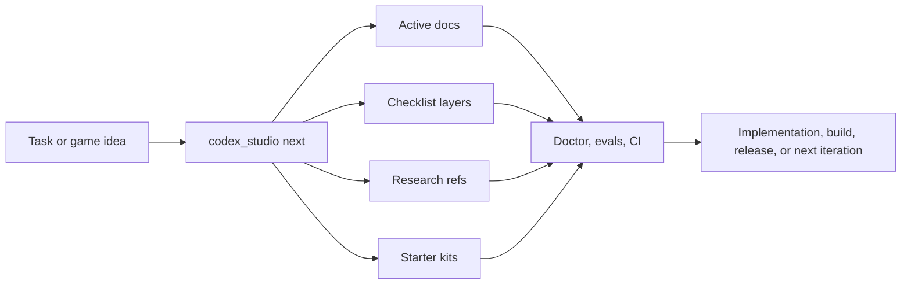

# Kaynexis Agentic Game Studio

> Plan. Route. Research. Validate. Ship.

A Codex-first multi-engine studio operating system for turning fuzzy game ideas into durable, engine-aware, testable work. The current Godot slice is a reference proof, not the main product. The main product is the system that helps a human operator and Codex keep working from repo truth instead of fragile chat memory across Godot, Unity, and Unreal.

`codex-first` `multi-engine` `game-development` `godot` `unity` `ue5` `starter-kits` `checklists` `research` `ci-cd` `developer-tooling`

Supported engine families: `Godot 4`, `Unity 6`, `Unreal 5`
Root runtime reference today: `Godot 4`

## Reference packs available now

The repo already ships with durable reference packs for all supported engine families and for cross-engine game architecture work.

| Reference area | What it answers | Start here |
| --- | --- | --- |
| engine architecture | how a feature should fit the chosen engine and repo layout | `docs/research/game-development/engines/README.md` |
| engine object model | which runtime class, data object, editor surface, or authored asset should own the work | `docs/research/game-development/engines/*-class-editor-object-map.md` |
| engine mechanic mapping | which 2D and 3D classes, nodes, components, actors, or assets to use for common mechanics | `docs/research/game-development/engines/*-2d-3d-class-and-mechanic-guide.md` |
| engine performance patterns | navigation, damage, pooling, pathfinding, and scale decisions | `docs/research/game-development/engines/*-2d-3d-navigation-damage-performance.md` |
| academic foundations | MDA, GameFlow, SDT, game feel, usability, accessibility, AI/pathfinding, and difficulty adaptation | `docs/research/game-development/foundations/README.md` |
| game systems architecture | combat, save/progression, loop/state ownership, AI/entity scale | `docs/research/game-development/systems/README.md` |
| genre design patterns | loop shape, risk profile, and example games by genre | `docs/research/game-development/genre/README.md` |
| production and release | content pipeline and release validation policy | `docs/research/game-development/production/` |
| operator workflow | onboarding, recipes, command usage, and maintainer setup | `docs/README.md` |
| execution glue | handoff contracts, feature traceability, doc-sync reminders, and golden examples | `docs/reference/handoff-contracts.md` |

## Engine families in one view

This repo is designed around three first-class engine families at the studio-system level.

| Engine family | Repo-level support | Starter-kit surface | Research surface | Adapter / validation surface |
| --- | --- | --- | --- | --- |
| `godot-4` | root-facing reference slice, active-doc baseline, export presets | scene/script runtime, smoke/export helpers | architecture, object model, class/mechanic, navigation/damage/performance | `scripts/godot_smoke.py`, `scripts/godot_export.py`, Godot checklist items |
| `unity-6` | starter-kit-first support with editor/runtime/test separation | runtime scripts, editor entrypoint, asmdef layout, prefab and ScriptableObject folders, edit-mode tests | architecture, object model, class/mechanic, navigation/damage/performance | `scripts/unity_adapter.py`, starter-kit smoke, Unity checklist items |
| `unreal-5` | starter-kit-first support with gameplay framework and packaging structure | gameplay classes, health component, config defaults, Blueprint/content guidance | architecture, object model, class/mechanic, navigation/damage/performance | `scripts/unreal_adapter.py`, starter-kit smoke, Unreal checklist items |

If you choose Unity or Unreal, the repo is not asking you to "translate a Godot template." It already includes engine-specific starter-kit, research, checklist, and CI contract surfaces for those engines.

## Genre packs now included

The genre layer is broader than the original combat-heavy presets. The repo now carries first-slice, contrast-set, and failure-mode guidance for:

- `action-roguelite`
- `deckbuilder-roguelike`
- `co-op-survival`
- `cozy-sim`
- `extraction-lite`
- `survivorlike`
- `narrative-adventure`
- `platformer`
- `puzzle`
- `colony-sim`
- `factory-automation`
- `metroidvania`
- `tactical-rpg`

If the game is still fuzzy, start with [genre presets](docs/reference/genre-presets.md), then read the deeper contrast-set notes in [genre research](docs/research/game-development/genre/README.md).

## Why this repo exists

Game projects usually decay in the same ways:

- key decisions live in chat instead of the repo
- engine setup is half-documented and half-tribal knowledge
- feature briefs, risks, and validation paths drift apart
- CI only checks files, not the actual working contract
- research gets done once, then disappears

This repo exists to stop that drift.

It gives you:

- one source of truth in `studio.toml`
- one front-door CLI in `python3 scripts/codex_studio.py`
- one routing system for tasks, agents, docs, research, and checklists
- one starter-kit contract for `godot-4`, `unity-6`, and `unreal-5`
- one validation surface for docs, kits, evals, workflows, Docker, and active project state

## Multi-engine support, explicitly

This repo is not Godot-only.

- Godot 4: root reference slice in `src/`, smoke/export helpers, active project baseline, and engine-specific mechanic guidance
- Unity 6: starter kit with runtime scripts, editor build entrypoint, ScriptableObject surface, prefab/script folders, edit-mode tests, and engine-specific mechanic guidance
- Unreal 5: starter kit with gameplay framework classes, health component, data asset surface, config defaults, Blueprint/content guidance, packaging adapter flow, and engine-specific mechanic guidance

The shared system layer treats all three as first-class engine families for routing, checklists, research, and CI contract smoke.

## Execution glue now included

The repo now includes the connective tissue that usually gets lost between planning and shipping:

- handoff contracts in `studio/docs/templates/handoff-contract.md`
- feature traceability in `studio/docs/templates/feature-traceability.md`
- golden examples in `docs/examples/`
- doc refresh suggestions via `python3 scripts/doc_sync_audit.py --json`
- a small pacing helper via `python3 scripts/balance_simulator.py --json`
- production research for platform readiness and hotfix/rollback decisions

## What this repo is

- a studio operating system for Codex-centered game development
- a planning and execution layer that survives across sessions
- a multi-engine starter-kit and validation platform
- a checklist and research system for gameplay, tools, pipeline, and production work

## What this repo is not

- not a finished commercial game
- not a full replacement for real engine editors
- not a fake "supports every engine" README with no adapter contract behind it
- not a one-off prompt pack that only works if someone remembers the thread history

## At a glance

- `studio.toml` holds project identity, engine selection, platforms, genre, checklist config, research policy, and tool paths
- `scripts/codex_studio.py` is the wizard-first entry point
- `studio/starter-kits/` contains engine adapters and scaffolds
- `studio/checklists/` contains mergeable checklist layers
- `studio/docs/active/` contains the living project state
- `docs/research/game-development/` contains durable research notes
- `.codex/agents/` and `.agents/skills/` define Codex behavior
- `.github/workflows/` and `Makefile` define CI/CD and local equivalents

## Which command should I run?

Use this table when you do not want to think about the internal architecture first.

| If you want to... | Run this | Why |
| --- | --- | --- |
| set up or reset the project baseline | `python3 scripts/codex_studio.py init` | seeds config, active docs, engine profile, and starter-kit assumptions |
| decide what to work on next | `python3 scripts/codex_studio.py next "your task"` | routes the task to the right skills, agents, docs, and research |
| see what must be true before calling the task done | `python3 scripts/codex_studio.py checklist --task "your task"` | merges base, engine, discipline, milestone, and custom checklist layers |
| create a durable research note before architecture work | `python3 scripts/codex_studio.py research --category systems --title "your note"` | keeps reasoning in the repo instead of chat history |
| inspect engine support or kit contracts | `python3 scripts/codex_studio.py engine --list --json` | shows which engine families the system recognizes |
| run a full repo health pass | `python3 scripts/codex_studio.py doctor` | checks repo, docs, kits, adapters, CI, and configured engine state |
| validate docs, tests, evals, and workflows together | `make ci-local` | runs the local CI-equivalent stack |

## Who this homepage is for

| If you are... | Start here | Then do this |
| --- | --- | --- |
| a solo developer choosing an engine | `docs/reference/engine-selection-guide.md` | run `python3 scripts/codex_studio.py init` |
| a gameplay programmer implementing a mechanic | `docs/research/game-development/engines/*-2d-3d-class-and-mechanic-guide.md` | run `next`, then `checklist` for the same task |
| a systems designer shaping combat, save, or progression | `docs/research/game-development/systems/README.md` | scaffold research first, then route the design task |
| a tools or pipeline owner | `docs/research/game-development/production/` | run `doctor`, `validate_workflows.py`, and `make ci-local` |
| a new contributor or collaborator | `docs/setup/first-hour-walkthrough.md` | read active docs, then run `doctor` and `engine --list` |
| a maintainer preparing GitHub or release flows | `docs/setup/github-maintainer-setup.md` and `docs/reference/ci-cd-architecture.md` | run the local CI and review the artifact report |

## Start from the right reference

If your next task sounds like one of these, start with the matching reference pack before you implement anything:

| If you are about to work on... | Read this first |
| --- | --- |
| choosing between Godot, Unity, and Unreal | `docs/reference/engine-selection-guide.md` |
| player movement, combat verbs, sensing, collisions, cameras, animation ownership | `docs/research/game-development/engines/*-2d-3d-class-and-mechanic-guide.md` |
| runtime vs data vs editor ownership | `docs/research/game-development/engines/*-class-editor-object-map.md` |
| AI architecture, A*, behavior trees, GOAP, or hierarchical planning tradeoffs | `docs/research/game-development/foundations/ai-pathfinding-and-decision-foundations.md` |
| flow, motivation, engagement, player psychology, or why a loop should work | `docs/research/game-development/foundations/design-frameworks-mda-gameflow-and-sdt.md` |
| game feel, readability, usability, accessibility, or feedback quality | `docs/research/game-development/foundations/game-feel-usability-and-accessibility-foundations.md` |
| difficulty tuning, adaptation, pacing, or DDA | `docs/research/game-development/foundations/difficulty-balance-and-adaptation-foundations.md` |
| pathfinding, pooling, damage/contact, high-entity-count gameplay | `docs/research/game-development/engines/*-2d-3d-navigation-damage-performance.md` and `docs/research/game-development/systems/ai-navigation-and-entity-scale-architecture.md` |
| inventory, equipment, loot, quick bars, or loadouts | `docs/research/game-development/systems/inventory-equipment-and-item-architecture.md` and `docs/research/game-development/systems/save-progression-and-runtime-data-architecture.md` |
| crafting, recipes, gathering loops, stations, or production resource flow | `docs/research/game-development/systems/crafting-recipes-and-resource-flow-architecture.md` and `docs/research/game-development/systems/inventory-equipment-and-item-architecture.md` |
| player avatar, locomotion, ability ownership, or character state | `docs/research/game-development/systems/character-controller-ability-and-state-architecture.md` |
| enemy roles, patrols, aggro, perception, encounter behavior, or boss design | `docs/research/game-development/systems/enemy-roster-behavior-and-encounter-architecture.md` and `docs/research/game-development/systems/ai-navigation-and-entity-scale-architecture.md` |
| dialogue, branching conversations, quest stages, or narrative consequence state | `docs/research/game-development/systems/dialogue-conversation-and-quest-state-architecture.md` and `docs/research/game-development/systems/save-progression-and-runtime-data-architecture.md` |
| companions, recruitable allies, follower AI, squads, or party-slot rules | `docs/research/game-development/systems/party-companion-and-squad-architecture.md` and `docs/research/game-development/systems/enemy-roster-behavior-and-encounter-architecture.md` |
| input, keyboard/gamepad parity, remapping, pause flow, or camera behavior | `docs/research/game-development/systems/input-controls-camera-and-remapping-architecture.md` |
| HUDs, menus, settings, onboarding, or upgrade screens | `docs/research/game-development/systems/ui-hud-menu-and-screen-flow-architecture.md` |
| abilities, perks, skill trees, cooldowns, upgrades, or build variety | `docs/research/game-development/systems/abilities-skill-trees-upgrades-and-build-architecture.md` |
| prompts, pickups, chests, levers, or interactable world objects | `docs/research/game-development/systems/interactions-pickups-and-world-object-architecture.md` |
| combat readability, damage flow, status effects, tuning boundaries | `docs/research/game-development/systems/combat-damage-and-effects-architecture.md` |
| state machines, update order, run loop structure, pausing, phase ownership | `docs/research/game-development/systems/gameplay-loop-state-and-update-architecture.md` |
| save/load, checkpoints, migrations, meta progression, runtime vs persistent state | `docs/research/game-development/systems/save-progression-and-runtime-data-architecture.md` |
| scoping a genre, comparing inspirations, spotting common failure modes | `docs/research/game-development/genre/genre-design-pattern-catalog.md` and `docs/research/game-development/genre/genre-example-matrix.md` |
| content pipeline, release confidence, CI/CD expectations | `docs/research/game-development/production/content-pipeline.md`, `docs/research/game-development/production/release-validation.md`, and `docs/reference/ci-cd-architecture.md` |
| platform deltas across PC, web, mobile, and console | `docs/research/game-development/production/platform-readiness-pc-web-mobile-console.md` |
| live incident, hotfix, and rollback decisions | `docs/research/game-development/production/incident-hotfix-and-rollback.md` |
| handoff quality, traceability, and doc refresh discipline | `docs/reference/handoff-contracts.md`, `docs/reference/feature-traceability.md`, and `docs/reference/doc-sync-audit.md` |
| daily operator flow, handoff, or task phrasing | `docs/reference/workflow-recipes.md` and `docs/reference/task-prompt-examples.md` |

## Typical flow



## Fastest start

Wizard mode:

```bash
python3 scripts/codex_studio.py init
```

Then do this immediately:

```bash
python3 scripts/codex_studio.py doctor
python3 scripts/codex_studio.py engine --list --json
python3 scripts/codex_studio.py next "Describe the next credible task for this project"
python3 scripts/codex_studio.py checklist --task "Describe the next credible task for this project"
```

Direct setup examples:

```bash
# Godot action prototype
python3 scripts/codex_studio.py init \
  --project-name "Signal Forge" \
  --engine godot-4 \
  --platform pc-premium \
  --genre action-roguelite \
  --yes

# Unity tactics prototype
python3 scripts/codex_studio.py init \
  --project-name "Grid Breakers" \
  --engine unity-6 \
  --platform pc-premium \
  --genre tactical-rpg \
  --yes

# Unreal co-op survival baseline
python3 scripts/codex_studio.py init \
  --project-name "Drift Colony" \
  --engine unreal-5 \
  --platform console-premium \
  --genre co-op-survival \
  --yes

# Unity deckbuilder roguelike baseline
python3 scripts/codex_studio.py init \
  --project-name "Ash Deck" \
  --engine unity-6 \
  --platform pc-premium \
  --genre deckbuilder-roguelike \
  --yes

# Unreal metroidvania baseline
python3 scripts/codex_studio.py init \
  --project-name "Vein Map" \
  --engine unreal-5 \
  --platform console-premium \
  --genre metroidvania \
  --yes

# Godot survivorlike baseline
python3 scripts/codex_studio.py init \
  --project-name "Night Orbit" \
  --engine godot-4 \
  --platform pc-premium \
  --genre survivorlike \
  --yes
```

After choosing an engine, immediately read the engine pack:

```bash
sed -n '1,80p' docs/research/game-development/engines/README.md
sed -n '1,120p' docs/research/game-development/engines/godot-4-2d-3d-class-and-mechanic-guide.md
sed -n '1,120p' docs/research/game-development/engines/unity-6-2d-3d-class-and-mechanic-guide.md
sed -n '1,120p' docs/research/game-development/engines/unreal-5-2d-3d-class-and-mechanic-guide.md
```

If the task is more architectural than engine-specific, open the systems pack too:

```bash
sed -n '1,120p' docs/research/game-development/systems/gameplay-loop-state-and-update-architecture.md
sed -n '1,120p' docs/research/game-development/systems/combat-damage-and-effects-architecture.md
sed -n '1,120p' docs/research/game-development/systems/ai-navigation-and-entity-scale-architecture.md
sed -n '1,120p' docs/research/game-development/systems/save-progression-and-runtime-data-architecture.md
```

## What a normal session looks like

Most sessions should look something like this:

1. open `studio/docs/active/current-sprint.md`
2. route one concrete task with `next`
3. resolve the checklist for that exact task
4. open the referenced research notes before coding or editing docs
5. make the smallest durable change that moves the project forward
6. run the narrowest meaningful validation loop
7. end with `doctor` or `make ci-local` if the change touched shared repo surfaces

The system works best when one task has:

- one clear player or operator outcome
- one engine or platform context
- one main constraint
- one validation goal

Good examples:

- `Implement a readable dodge cancel window for the first Godot combat room`
- `Design a Unity-friendly save-state ownership model for mission progress`
- `Prepare the first Unreal Win64 packaging path and document the constraints`
- `Add a pooled enemy projectile runtime path for Unity without breaking readability`
- `Define what persists after a failed run versus what resets`
- `Design controller remapping and pause-menu navigation without breaking gameplay input`
- `Separate authored skill definitions, current-run upgrades, and durable meta unlocks`
- `Design pickup prompts, interaction validation, and loot persistence for reward chests`

Weak examples:

- `work on combat`
- `fix engine stuff`
- `make the UI better`
- `do optimization`
- `add skills`
- `do inventory`
- `improve controls`

## Real command examples

### The minimum useful loop

```bash
python3 scripts/codex_studio.py next \
  "Add a second enemy type that pressures movement instead of burst damage"
python3 scripts/codex_studio.py checklist \
  --task "Add a second enemy type that pressures movement instead of burst damage"
python3 scripts/run_local_evals.py --json
```

### Route the next task

```bash
python3 scripts/codex_studio.py next \
  "Implement a performant 2D enemy pathfinding pass for Unity" \
  --json
```

Example output excerpt:

```json
{
  "route": "combat / gameplay",
  "skills": ["combat-loop", "mechanic-design", "gameplay-slice"],
  "agents": ["combat_designer", "gameplay_programmer", "qa_tester"],
  "engine_kit": {
    "id": "unity-6",
    "engine": "unity",
    "version_family": "6000.x"
  },
  "research_refs": [
    "docs/research/game-development/engines/unity-6-class-editor-object-map.md",
    "docs/research/game-development/engines/unity-6-2d-3d-class-and-mechanic-guide.md",
    "docs/research/game-development/engines/unity-6-2d-3d-navigation-damage-performance.md",
    "docs/research/game-development/systems/ai-navigation-and-entity-scale-architecture.md"
  ]
}
```

### Render a merged checklist

```bash
python3 scripts/codex_studio.py checklist \
  --task "Ship the first Godot combat room" \
  --json
```

Example output excerpt:

```json
{
  "engine": "godot-4",
  "disciplines": ["gameplay"],
  "items": [
    {
      "id": "godot-static-smoke",
      "title": "Static smoke covers scene nodes, scripts, and export presets",
      "validation": "Run python3 scripts/godot_smoke.py --static-only"
    },
    {
      "id": "gameplay-readability",
      "title": "Core action remains readable before adding depth",
      "validation": "Document the teach/read/react loop in the active feature doc"
    }
  ]
}
```

### Scaffold a research note

```bash
python3 scripts/codex_studio.py research \
  --category systems \
  --title "Combat readability baseline"
```

That creates a dated note from the shared research template and keeps the result inside the repo instead of burying it in chat history.

### Inspect engine support

```bash
python3 scripts/codex_studio.py engine --list --json
```

Example output excerpt:

```json
[
  {
    "id": "godot-4",
    "engine": "godot",
    "version_family": "4.x"
  },
  {
    "id": "unity-6",
    "engine": "unity",
    "version_family": "6000.x"
  },
  {
    "id": "unreal-5",
    "engine": "unreal",
    "version_family": "5.x"
  }
]
```

## Example sessions by engine

### Godot gameplay slice

```bash
python3 scripts/codex_studio.py init --engine godot-4 --genre action-roguelite --yes
python3 scripts/codex_studio.py next \
  "Implement a short parry window with clear failure feedback for the tutorial encounter"
python3 scripts/codex_studio.py checklist \
  --task "Implement a short parry window with clear failure feedback for the tutorial encounter"
python3 scripts/godot_smoke.py --static-only
python3 -m pytest -q tests/test_godot_surface.py
```

### Unity mechanic and performance pass

```bash
python3 scripts/codex_studio.py init --engine unity-6 --genre tactical-rpg --yes
python3 scripts/codex_studio.py next \
  "Design a performant 2D enemy pathfinding setup for Unity rooms with blockers"
python3 scripts/codex_studio.py checklist \
  --task "Design a performant 2D enemy pathfinding setup for Unity rooms with blockers"
python3 scripts/unity_adapter.py test \
  --project-path studio/starter-kits/unity-6/scaffold \
  --dry-run --json
```

If a local Unity editor is not auto-detected, append `--unity-path tools/engine-stubs/unity/Unity` for contract smoke only.

### Unreal packaging and release prep

```bash
python3 scripts/codex_studio.py init --engine unreal-5 --genre co-op-survival --yes
python3 scripts/codex_studio.py next \
  "Prepare the first Unreal package flow for a Win64 demo build"
python3 scripts/codex_studio.py checklist \
  --task "Prepare the first Unreal package flow for a Win64 demo build"
python3 scripts/unreal_adapter.py package \
  --project-path studio/starter-kits/unreal-5/scaffold \
  --uat-path tools/engine-stubs/unreal/RunUAT.sh \
  --platform Win64 \
  --dry-run --json
```

### Cross-engine research before a big decision

```bash
python3 scripts/codex_studio.py research \
  --category systems \
  --title "Projectile ownership and scale path"
python3 scripts/codex_studio.py next \
  "Choose between pooled objects and higher-scale entity representation for projectile-heavy combat"
python3 scripts/codex_studio.py checklist \
  --task "Choose between pooled objects and higher-scale entity representation for projectile-heavy combat"
```

### Controls and UI architecture pass

```bash
python3 scripts/codex_studio.py next \
  "Design controller remapping, pause flow, and HUD navigation for keyboard and gamepad parity"
python3 scripts/codex_studio.py checklist \
  --task "Design controller remapping, pause flow, and HUD navigation for keyboard and gamepad parity"
```

### Ability and progression architecture pass

```bash
python3 scripts/codex_studio.py next \
  "Separate authored skill definitions, current-run upgrades, and durable meta unlocks"
python3 scripts/codex_studio.py checklist \
  --task "Separate authored skill definitions, current-run upgrades, and durable meta unlocks"
```

### Interactions and pickups architecture pass

```bash
python3 scripts/codex_studio.py next \
  "Design pickup prompts, interaction validation, and loot persistence for reward chests"
python3 scripts/codex_studio.py checklist \
  --task "Design pickup prompts, interaction validation, and loot persistence for reward chests"
```

## Common workflows

### 1. Solo Godot prototype

```bash
python3 scripts/codex_studio.py init --engine godot-4 --genre action-roguelite --yes
python3 scripts/codex_studio.py next "Design the first combat room"
python3 scripts/codex_studio.py checklist --task "Implement the first combat room"
python3 scripts/godot_smoke.py --static-only
python3 -m pytest -q tests/test_godot_surface.py
```

### 2. Unity architecture and performance pass

```bash
python3 scripts/codex_studio.py next "Refactor combat into a pooled projectile system for Unity"
python3 scripts/codex_studio.py checklist --task "Refactor combat into a pooled projectile system for Unity"
python3 scripts/unity_adapter.py test \
  --project-path studio/starter-kits/unity-6/scaffold \
  --dry-run --json
```

If Unity is not installed locally, add `--unity-path tools/engine-stubs/unity/Unity` to keep the adapter contract smoke reproducible.

### 3. Unreal packaging prep

```bash
python3 scripts/codex_studio.py next "Prepare the first Unreal package flow for Win64"
python3 scripts/unreal_adapter.py package \
  --project-path studio/starter-kits/unreal-5/scaffold \
  --uat-path tools/engine-stubs/unreal/RunUAT.sh \
  --platform Win64 \
  --dry-run --json
python3 scripts/validate_engine_kits.py --engine unreal-5
```

### 4. Repo-wide health pass

```bash
python3 scripts/codex_studio.py doctor
python3 scripts/run_local_evals.py --json
python3 scripts/validate_workflows.py --json
make ci-local
```

## What files usually change in real work

This repo is designed so a normal task leaves a visible trail.

| Work type | Files you should expect to touch |
| --- | --- |
| new project setup | `studio.toml`, `studio/docs/active/game-brief.md`, `studio/docs/active/engine-profile.md`, `studio/docs/active/current-sprint.md` |
| mechanic or gameplay slice | engine runtime files, one feature brief, one test plan or QA surface, relevant active docs |
| architecture change | one ADR or research note, one active doc update, relevant checklist-driven validation files |
| save/progression change | system docs, save plan docs, migration or persistence notes, tests |
| CI/CD or tooling change | `scripts/`, `.github/workflows/`, `Makefile`, `docs/reference/ci-cd-architecture.md`, and eval/test surfaces |
| research-driven decision | one research note under `docs/research/game-development/`, then route/checklist output for the actual implementation task |

If a task changes code but leaves no durable doc, checklist, or validation trail, it is usually under-documented.

## Engine support model

Each engine family now has a four-layer research pack:

- architecture baseline
- class/editor/object ownership map
- 2D/3D class and mechanic guide
- navigation, damage, and performance guide

Examples:

- `docs/research/game-development/engines/godot-4-2d-3d-class-and-mechanic-guide.md`
- `docs/research/game-development/engines/unity-6-2d-3d-class-and-mechanic-guide.md`
- `docs/research/game-development/engines/unreal-5-2d-3d-class-and-mechanic-guide.md`

Those guides are where the repo spells out the most-used classes, object ownership, mechanic patterns, writing style expectations, and common mistakes for each engine family.

Use those notes to answer questions like:

- which class or object should own player movement in this engine
- which object should own contact, damage, and sensing
- where shared tuning data should live
- which editor surface designers are supposed to touch
- what naming and writing style the engine expects
- what mistakes usually make the mechanic brittle or slow

This repo uses starter-kit parity, not fake gameplay parity.

| Engine | Kit ID | What is included | Local smoke path | Real editor requirement |
| --- | --- | --- | --- | --- |
| Godot | `godot-4` | scene/script/export baseline and reference combat slice | `python3 scripts/godot_smoke.py --static-only` | `GODOT_BIN` for runtime smoke/export |
| Unity | `unity-6` | package, asmdef, runtime sample, adapter, test/build command contract | `python3 scripts/unity_adapter.py ... --dry-run --json` | `UNITY_CLI` for editor-backed test/build |
| Unreal | `unreal-5` | project/module scaffold, gameplay sample surface, adapter, packaging contract | `python3 scripts/unreal_adapter.py ... --dry-run --json` | `UNREAL_UAT` or `UNREAL_EDITOR` for engine-backed packaging |

Starter-kit docs:

- `studio/starter-kits/godot-4/kit.toml`
- `studio/starter-kits/unity-6/README.md`
- `studio/starter-kits/unreal-5/README.md`

Inspect or validate all kits:

```bash
python3 scripts/codex_studio.py engine --list
python3 scripts/validate_engine_kits.py --json
python3 scripts/starter_kit_contract_smoke.py --engine godot-4 --json
python3 scripts/starter_kit_contract_smoke.py --engine unity-6 --json
python3 scripts/starter_kit_contract_smoke.py --engine unreal-5 --json
```

## Checklist system

Checklist resolution is layered and deterministic:

1. `base`
2. `engine`
3. `discipline`
4. `milestone`
5. `custom`

Custom rules live in `studio/checklists/custom/`.

This means a single task can automatically pull:

- repo-health checks
- engine-specific architecture checks
- gameplay or tools discipline checks
- milestone rules like `prototype` or `build-release`
- your own custom studio rules

## Research system

Research is part of the workflow, not a side quest.

Core research zones:

- `docs/research/game-development/engines/`
- `docs/research/game-development/systems/`
- `docs/research/game-development/production/`
- `docs/research/game-development/genre/`
- `docs/research/game-development/policy.md`
- `docs/research/game-development/templates/research-note.md`

Recommended reference sweep:

### Engine packs

- `docs/research/game-development/engines/godot-4-architecture.md`
- `docs/research/game-development/engines/godot-4-class-editor-object-map.md`
- `docs/research/game-development/engines/godot-4-2d-3d-class-and-mechanic-guide.md`
- `docs/research/game-development/engines/godot-4-2d-3d-navigation-damage-performance.md`
- `docs/research/game-development/engines/unity-6-architecture.md`
- `docs/research/game-development/engines/unity-6-class-editor-object-map.md`
- `docs/research/game-development/engines/unity-6-2d-3d-class-and-mechanic-guide.md`
- `docs/research/game-development/engines/unity-6-2d-3d-navigation-damage-performance.md`
- `docs/research/game-development/engines/unreal-5-architecture.md`
- `docs/research/game-development/engines/unreal-5-class-editor-object-map.md`
- `docs/research/game-development/engines/unreal-5-2d-3d-class-and-mechanic-guide.md`
- `docs/research/game-development/engines/unreal-5-2d-3d-navigation-damage-performance.md`

### Systems packs

- `docs/research/game-development/systems/gameplay-loop-state-and-update-architecture.md`
- `docs/research/game-development/systems/combat-damage-and-effects-architecture.md`
- `docs/research/game-development/systems/ai-navigation-and-entity-scale-architecture.md`
- `docs/research/game-development/systems/save-progression-and-runtime-data-architecture.md`
- `docs/research/game-development/systems/inventory-equipment-and-item-architecture.md`
- `docs/research/game-development/systems/character-controller-ability-and-state-architecture.md`
- `docs/research/game-development/systems/enemy-roster-behavior-and-encounter-architecture.md`
- `docs/research/game-development/systems/input-controls-camera-and-remapping-architecture.md`
- `docs/research/game-development/systems/ui-hud-menu-and-screen-flow-architecture.md`
- `docs/research/game-development/systems/abilities-skill-trees-upgrades-and-build-architecture.md`
- `docs/research/game-development/systems/interactions-pickups-and-world-object-architecture.md`

### Genre and production packs

- `docs/research/game-development/genre/genre-design-pattern-catalog.md`
- `docs/research/game-development/genre/genre-example-matrix.md`
- `docs/research/game-development/production/content-pipeline.md`
- `docs/research/game-development/production/release-validation.md`

### Policy and note scaffolding

- `docs/research/game-development/policy.md`
- `docs/research/game-development/templates/research-note.md`

## CI/CD and release surface

This repo ships with a broad CI/CD layer and local equivalents.

| Workflow or command | Role | Output |
| --- | --- | --- |
| `make ci-local` | local CI-equivalent stack | `build/ci/local/` |
| `make ci-workflows` | validate workflow definitions themselves | JSON workflow report |
| `make starter-kit-smoke` | contract smoke across engines | per-engine smoke output |
| `make ci-report` | generate CI artifact summaries | `build/ci/local/ci-report.json` and `.md` |
| `.github/workflows/repo-validate.yml` | PR validation matrix | workflow artifacts |
| `.github/workflows/starter-kit-contracts.yml` | starter-kit contract smoke | engine artifact bundles |
| `.github/workflows/release-readiness.yml` | manual release-readiness bundle | build metadata artifact |
| `.github/workflows/nightly-audit.yml` | scheduled repo audit | audit artifact |

Example local CI stack:

```bash
make ci-workflows
python3 scripts/run_local_evals.py --json
python3 -m pytest -q tests
python3 scripts/ci_artifact_report.py --output-dir build/ci/manual-check --label manual-check --json
make docker-verify
```

See `docs/reference/ci-cd-architecture.md` for the full workflow map.

## Docker helper environment

If you want an isolated Ubuntu 24.04 + Python tooling shell:

```bash
docker compose build
docker compose run --rm app
```

Inside the container, the repository is mounted at `/app`.

## Repository map

```text
studio.toml
scripts/codex_studio.py
studio/starter-kits/
studio/checklists/
studio/docs/active/
docs/research/game-development/
.codex/agents/
.agents/skills/
.github/workflows/
tools/engine-stubs/
tests/
```

## Suggested GitHub metadata

Suggested repository description:

> A Codex-first multi-engine studio operating system for planning, routing, research, starter kits, and CI/CD.

Suggested topics:

- `codex`
- `multi-engine`
- `game-development`
- `game-studio`
- `developer-tooling`
- `starter-kits`
- `checklists`
- `ci-cd`
- `godot`
- `godot-engine`
- `unity`
- `unity3d`
- `ue5`
- `unreal-engine`
- `game-architecture`
- `research-driven-development`

Apply these later from the GitHub UI or with `gh repo edit`. See `docs/setup/github-maintainer-setup.md`.

## First 15 minutes

1. Run `python3 scripts/codex_studio.py init`
2. Open `studio.toml`
3. Open `studio/docs/active/game-brief.md`
4. Open `studio/docs/active/engine-profile.md`
5. Open `studio/docs/active/current-sprint.md`
6. Run `python3 scripts/codex_studio.py next "Describe the next gameplay or pipeline task"`
7. Run `python3 scripts/codex_studio.py checklist --task "Describe the same task"`
8. Run `python3 scripts/run_local_evals.py`
9. Run `python3 scripts/codex_studio.py doctor`

## FAQ

### Is the Godot sample the main product?

No. The Godot slice is a reference proof. The main product is the studio operating system around it.

### Is this repo biased toward Godot?

The root runtime example is currently Godot-based, but the repo-level operating system is intentionally multi-engine. Unity and Unreal already have dedicated starter kits, adapters, checklists, CI contract smoke, and engine-specific class/mechanic research.

### Does Unity and Unreal support require a local installation?

For real builds, yes. Contract smoke works with repo-local stubs, but editor-backed coverage starts when `UNITY_CLI`, `UNREAL_UAT`, or `UNREAL_EDITOR` points to a real installation.

### Can I use only one engine?

Yes. Set your primary engine in `studio.toml` and ignore the other kits until you need them.

### Can I add custom rules for my own team?

Yes. Put them in `studio/checklists/custom/` and route/checklist resolution will merge them after base, engine, discipline, and milestone layers.

### Is Docker required?

No. Docker is optional and only meant as a helper environment for scripts, docs, and validation tools.

### Can I keep my own language in project docs?

Yes, but the repo defaults to English-first onboarding and CLI output so the system stays easier to share, automate, and review.

## Further reading

- `docs/setup/first-hour-walkthrough.md`
- `docs/README.md`
- `docs/reference/engine-selection-guide.md`
- `docs/research/game-development/README.md`
- `docs/research/game-development/engines/README.md`
- `docs/research/game-development/systems/README.md`
- `docs/research/game-development/genre/README.md`
- `docs/research/game-development/engines/godot-4-architecture.md`
- `docs/research/game-development/engines/unity-6-architecture.md`
- `docs/research/game-development/engines/unreal-5-architecture.md`
- `docs/research/game-development/engines/godot-4-class-editor-object-map.md`
- `docs/research/game-development/engines/unity-6-class-editor-object-map.md`
- `docs/research/game-development/engines/unreal-5-class-editor-object-map.md`
- `docs/research/game-development/engines/godot-4-2d-3d-class-and-mechanic-guide.md`
- `docs/research/game-development/engines/unity-6-2d-3d-class-and-mechanic-guide.md`
- `docs/research/game-development/engines/unreal-5-2d-3d-class-and-mechanic-guide.md`
- `docs/research/game-development/engines/godot-4-2d-3d-navigation-damage-performance.md`
- `docs/research/game-development/engines/unity-6-2d-3d-navigation-damage-performance.md`
- `docs/research/game-development/engines/unreal-5-2d-3d-navigation-damage-performance.md`
- `docs/research/game-development/systems/gameplay-loop-state-and-update-architecture.md`
- `docs/research/game-development/systems/combat-damage-and-effects-architecture.md`
- `docs/research/game-development/systems/ai-navigation-and-entity-scale-architecture.md`
- `docs/research/game-development/systems/save-progression-and-runtime-data-architecture.md`
- `docs/research/game-development/systems/inventory-equipment-and-item-architecture.md`
- `docs/research/game-development/systems/character-controller-ability-and-state-architecture.md`
- `docs/research/game-development/systems/enemy-roster-behavior-and-encounter-architecture.md`
- `docs/research/game-development/systems/input-controls-camera-and-remapping-architecture.md`
- `docs/research/game-development/systems/ui-hud-menu-and-screen-flow-architecture.md`
- `docs/research/game-development/systems/abilities-skill-trees-upgrades-and-build-architecture.md`
- `docs/research/game-development/systems/interactions-pickups-and-world-object-architecture.md`
- `docs/research/game-development/genre/genre-design-pattern-catalog.md`
- `docs/research/game-development/genre/genre-example-matrix.md`
- `docs/research/game-development/production/content-pipeline.md`
- `docs/research/game-development/production/release-validation.md`
- `docs/research/game-development/policy.md`
- `docs/reference/workflow-recipes.md`
- `docs/reference/task-prompt-examples.md`
- `docs/reference/command-cheatsheet.md`
- `docs/reference/ci-cd-architecture.md`
- `docs/reference/engine-agent-guidelines.md`
- `docs/setup/getting-started.md`
- `docs/setup/github-maintainer-setup.md`
- `codex-game-studio-v3-roadmap.md`
- `CHANGELOG.md`
