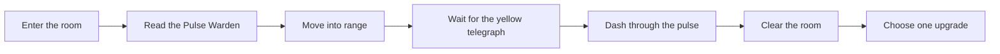

# Kaynexis Agentic Game Studio

A fast, timing-driven Godot 4 action prototype built around a single compact combat room.

This project is a focused vertical slice. The goal is simple: step into the arena, read the enemy, commit to the right dash timing, survive mistakes, and cash out the encounter with a meaningful reward pick.

## At a Glance

- Engine: Godot 4
- Genre direction: action / roguelite-flavored combat prototype
- Current slice: one complete combat room
- Core verbs: move, dash, survive, choose an upgrade
- Target feel: readable, quick, replayable, high-pressure

## Core Pitch

The prototype is built around a very small but clear promise:

- combat should be understandable in seconds
- danger should be readable before it becomes punishing
- success should come from timing and commitment
- the reward beat should arrive immediately after the clear

Instead of spreading effort across systems too early, the project proves the loop in one room first.

## Current Playable Slice

The current version includes:

- Top-down character movement
- A dash with cooldown-driven commitment
- The Pulse Warden enemy and its telegraphed pulse attack
- A three-hit fail state with room reset
- A post-clear reward choice
- Export presets for Linux and Windows desktop builds

## Gameplay Flow



## Why This Prototype Exists

This repository is meant to answer a few important design questions as early as possible:

- Is the combat readable at a glance?
- Does the dash feel strong enough to be a primary survival verb?
- Does failure teach the player something immediately?
- Does a single reward choice create enough payoff to want another room?

If those answers are strong, the next room, second enemy, and larger progression layer become much easier to build with confidence.

## Controls

- Move: `W`, `A`, `S`, `D`
- Move alternative: arrow keys
- Dash: `Space`
- Dash alternative: `Enter`
- Reward choice 1: `1`
- Reward choice 2: `2`

## How the Room Works

The room is intentionally easy to read:

- The player starts on the left side of the arena
- The Pulse Warden holds the center-right space
- A yellow telegraph warns that the pulse is about to fire
- A red pulse punishes hesitation
- Dashing through the pulse defeats the enemy
- Failing the timing costs health and resets position
- Clearing the room unlocks one of two immediate upgrades

## Reward Choices

After clearing the encounter, the player chooses one of two modules:

- `Stride Module`
  Increases movement speed and gives the room a lighter, faster rhythm
- `Phase Module`
  Reduces dash cooldown and makes aggressive re-engagement easier

Even in this early slice, the reward beat starts shaping how the next room could branch.

## Run the Project

1. Install Godot 4.x
2. Open this folder in Godot
3. Load [project.godot](./project.godot)
4. Run the main scene

## Export

Included presets:

- `Linux/X11`
- `Windows Desktop`

Default output paths:

- `build/linux/kaynexis-agentic-game-studio.x86_64`
- `build/windows/kaynexis-agentic-game-studio.exe`

## Project Structure

```text
project.godot
export_presets.cfg
src/
  main.tscn
  main.gd
  player.gd
  pulse_warden.gd
```

## Current Design Strengths

- Very fast onboarding: the room teaches itself visually
- Tight scope: everything on screen serves the main loop
- Clear fail state: mistakes are readable and recoverable
- Immediate reward beat: the room ends with a choice, not just a stop

## Planned Next Steps

Good next expansions for this prototype:

- Add a second enemy role with a different pressure pattern
- Introduce a second wave after the first clear
- Add stronger visual hit feedback and arena atmosphere
- Separate dash into its own input action
- Add a lightweight UI shell for restart and replay flow
- Build a larger encounter chain from proven room modules

## Notes for Collaborators

If you extend the prototype, try to protect the original intent:

- keep the room readable
- add one new idea at a time
- avoid system sprawl before the combat loop is fully locked
- preserve the feeling that every choice changes the next encounter

## Repository Link

[GitHub Repository](https://github.com/YenidoganKursat/Kaynexis-Agentic-Game-Studio)
