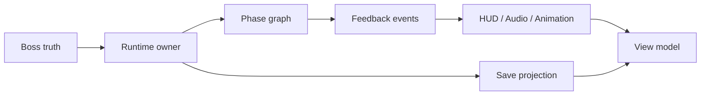

# Architecture Example

## Scope
- A boss encounter, an inventory HUD, and a save projection all need to share state without fighting over ownership.

## Baseline
- The current design stores truth in several places:
  - gameplay logic in the boss script
  - HUD values in UI fields
  - save data in ad hoc JSON
- This makes phase changes hard to test and causes replay/load bugs.

## Decision order
1. Pick the canonical owner for encounter truth.
2. Pick the state graph for encounter phases.
3. Pick the event path for UI/audio feedback.
4. Pick the projection path for HUD and save data.

## Diagram

This diagram makes the split visible:
- one runtime owner
- one phase graph
- one feedback path
- one projection path for HUD and save

## Engine-shaped examples
- Godot: an Autoload owns boss phase truth, signals broadcast phase changes, Resources hold shared tuning data, and Control nodes only project the current state.
- Unity: a runtime encounter coordinator owns the state, ScriptableObject holds tuning data, and the HUD reads a projected view model instead of the combat script directly.
- Unreal: GameMode or a dedicated subsystem owns the encounter rules, StateTree manages phases, and UMG projects from GameState or PlayerState.

## Good agent prompts
- Design a state graph that keeps boss phase truth separate from HUD projection.
- Design an event layer for combat feedback without moving rule ownership into the UI.
- Design a projection boundary so save data captures only canonical runtime state.

## Validation
- One clear owner for runtime truth.
- One clear event path.
- One clear state transition.
- One clear projection path.
- One narrow test or smoke that proves the boundary.
