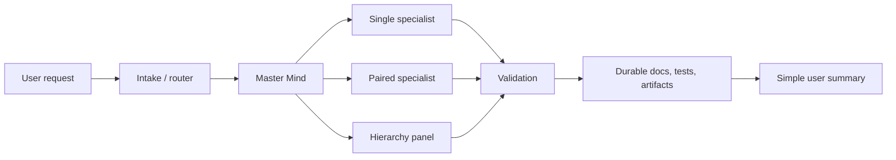
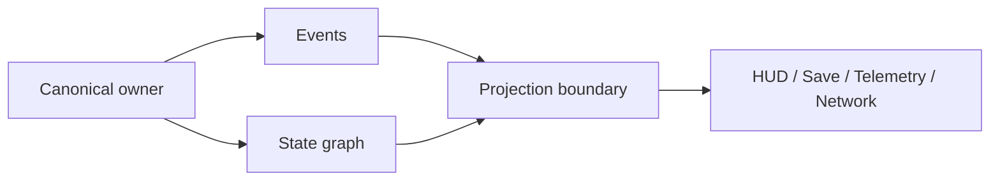

# Architecture Guide

## Summary
- Use this guide when the task is really about state ownership, event flow, authority, or projection rather than one small mechanic.
- It defines the advanced architecture families this repo expects the agent to reason about before implementation.

## Primary sources
- `docs/research/game-development/architecture/README.md`
- `docs/research/game-development/architecture/authority.md`
- `docs/research/game-development/architecture/events.md`
- `docs/research/game-development/architecture/state.md`
- `docs/research/game-development/architecture/projection.md`
- `docs/reference/custom-architecture.md`
- `docs/reference/extensions-guide.md`
- `docs/reference/code-review.md`

## Why this matters to this repo
- The repo already has strong research for systems, performance, quality, and libraries.
- Architecture work is the step above those notes: it decides who owns truth, how phase changes happen, and how state is projected into UI, saves, and network state.

## Decision impact
- Pick the smallest architecture that keeps ownership explicit.
- Choose one of these families first:
  - authority
  - events
  - state
  - projection
- If the task also involves scale or budget pressure, pair this guide with `docs/reference/perf-guide.md` or `docs/reference/advanced-perf-guide.md`.

## Diagrams

These diagrams are reading aids, not extra policy. They show the smallest useful shape before implementation.

### Studio control plane

### Architecture ownership flow

### How to use the diagrams

- If you cannot name the canonical owner, stop.
- If UI is becoming the truth, move it back to projection.
- If the task only needs one lane, keep the single specialist mode.
- If the task needs more than one lane, use the smallest hierarchy that still has one owner per lane.

## Architecture families

### Authority
- Use when one system must own the canonical truth.
- Good for combat rules, encounter phases, save state, or replicated state.

### Events
- Use when many systems need to react to the same moment.
- Good for combat feedback, UI updates, audio, telemetry, and quest triggers.

### State
- Use when the feature has legal transitions or phase graphs.
- Good for bosses, missions, menus, AI modes, and encounter flow.

### Projection
- Use when runtime truth must be displayed or persisted without becoming the truth itself.
- Good for HUDs, menus, save files, and telemetry.

### Custom rule packs
- Use when a task needs project-specific house rules, request contracts, or override points on top of the canonical architecture families.
- Good for bespoke inventory rules, designer-tunable pacing packs, mod-friendly request contracts, and house-rule layers.
- Keep fixed rules separate from overrideable rules, and name the fallback before implementation.

### Extension packs
- Use when a task needs opt-in add-ons, hook points, or plugin-like capabilities that should stay separable from the canonical architecture and custom rule pack.
- Good for editor panels, optional UI surfaces, debug overlays, and feature hooks that can be enabled or disabled cleanly.
- Keep the manifest, hook points, override points, and fallback path explicit.

## Engine anchors
- Godot: signals, Autoload, Resource, scene tree, and node ownership make the authority/event split practical.
- Unity: MonoBehaviour, ScriptableObject, UI Toolkit, uGUI, and execution order support clear projection boundaries.
- Unreal: GameMode, GameState, PlayerState, Actor Components, StateTree, and UMG support authoritative state and projection.

## Related docs
- `docs/reference/custom-architecture.md`
- `docs/examples/custom-architecture-example.md`
- `docs/reference/extensions-guide.md`
- `docs/examples/extensions-example.md`

## Example prompts for the agent
- Design a boss phase authority model that keeps UI and animation as projections only.
- Design an event-driven combat feedback layer that does not make UI the source of truth.
- Design a state graph for a stealth mission that keeps detection, alertness, and recovery explicit.
- Design a projection boundary for inventory, save, and HUD so runtime state stays canonical.

## Validation
- Name the owner of canonical truth.
- Name the event source and listener set if events are involved.
- Name the state graph and transition rules if phases are involved.
- Name the projection targets if UI, save, telemetry, or network are involved.
- Run one narrow smoke or test that proves the boundary.
